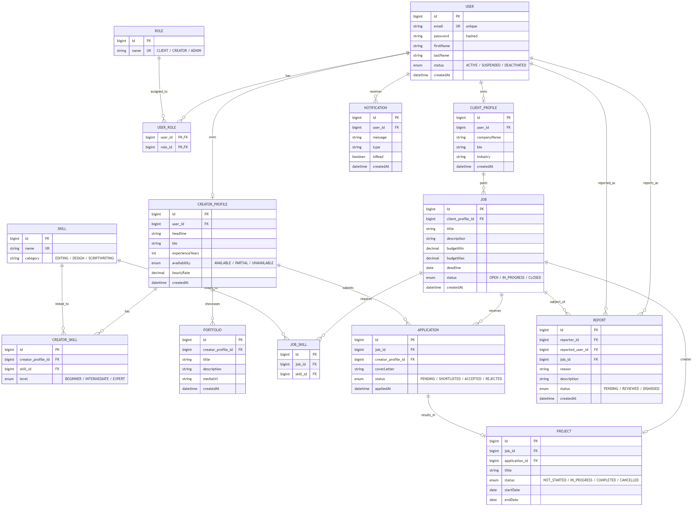
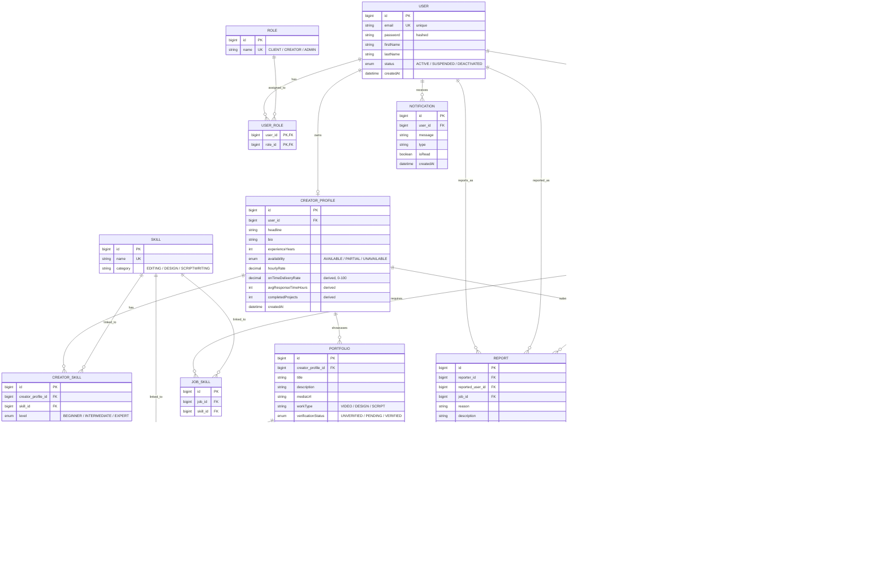

# ER Diagram

```mermaid
erDiagram
    USER ||--o{ USER_ROLE : has
    ROLE ||--o{ USER_ROLE : assigned_to
    USER ||--o| CLIENT_PROFILE : owns
    USER ||--o| CREATOR_PROFILE : owns
    CREATOR_PROFILE ||--o{ CREATOR_SKILL : has
    SKILL ||--o{ CREATOR_SKILL : linked_to
    CREATOR_PROFILE ||--o{ PORTFOLIO : showcases
    PORTFOLIO ||--o{ PORTFOLIO_SKILL : tagged_with
    SKILL ||--o{ PORTFOLIO_SKILL : linked_to
    CLIENT_PROFILE ||--o{ JOB : posts
    JOB ||--o{ JOB_SKILL : requires
    SKILL ||--o{ JOB_SKILL : linked_to
    JOB ||--o{ APPLICATION : receives
    CREATOR_PROFILE ||--o{ APPLICATION : submits
    APPLICATION ||--o{ APPLICATION_SAMPLE : includes
    PORTFOLIO ||--o{ APPLICATION_SAMPLE : submitted_as
    JOB ||--o| PROJECT : creates
    APPLICATION ||--o| PROJECT : results_in
    USER ||--o{ NOTIFICATION : receives
    USER ||--o{ REPORT : reports_as
    USER ||--o{ REPORT : reported_as
    JOB ||--o{ REPORT : subject_of

    USER {
        bigint id PK
        string email UK "unique"
        string password "hashed"
        string firstName
        string lastName
        enum status "ACTIVE / SUSPENDED / DEACTIVATED"
        datetime createdAt
    }

    ROLE {
        bigint id PK
        string name UK "CLIENT / CREATOR / ADMIN"
    }

    USER_ROLE {
        bigint user_id PK,FK
        bigint role_id PK,FK
    }

    CLIENT_PROFILE {
        bigint id PK
        bigint user_id FK
        string companyName
        string bio
        string industry
        datetime createdAt
    }

    CREATOR_PROFILE {
        bigint id PK
        bigint user_id FK
        string headline
        string bio
        int experienceYears
        enum availability "AVAILABLE / PARTIAL / UNAVAILABLE"
        decimal hourlyRate
        decimal onTimeDeliveryRate "derived, 0-100"
        int avgResponseTimeHours "derived"
        int completedProjects "derived"
        datetime createdAt
    }

    SKILL {
        bigint id PK
        string name UK
        string category "EDITING / DESIGN / SCRIPTWRITING"
    }

    CREATOR_SKILL {
        bigint id PK
        bigint creator_profile_id FK
        bigint skill_id FK
        enum level "BEGINNER / INTERMEDIATE / EXPERT"
    }

    PORTFOLIO {
        bigint id PK
        bigint creator_profile_id FK
        string title
        string description
        string mediaUrl
        string workType "VIDEO / DESIGN / SCRIPT"
        enum verificationStatus "UNVERIFIED / PENDING / VERIFIED"
        string collaborationRole "e.g. Lead Editor"
        string outcomeStats "e.g. 2M views"
        datetime createdAt
    }

    PORTFOLIO_SKILL {
        bigint id PK
        bigint portfolio_id FK
        bigint skill_id FK
    }

    JOB {
        bigint id PK
        bigint client_profile_id FK
        string title
        string description
        string creativeBrief "required"
        string styleKeywords "e.g. cinematic, minimal"
        string referenceLinks "inspiration URLs"
        decimal budgetMin
        decimal budgetMax
        date deadline
        enum status "OPEN / IN_PROGRESS / CLOSED"
        datetime createdAt
    }

    JOB_SKILL {
        bigint id PK
        bigint job_id FK
        bigint skill_id FK
    }

    APPLICATION {
        bigint id PK
        bigint job_id FK
        bigint creator_profile_id FK
        string coverLetter
        string briefResponse "answers the brief"
        decimal proposedRate
        int estimatedDays
        decimal matchScore "computed 0-100"
        int responseTimeHours "apply latency"
        enum status "PENDING / SHORTLISTED / ACCEPTED / REJECTED"
        datetime appliedAt
    }

    APPLICATION_SAMPLE {
        bigint id PK
        bigint application_id FK
        bigint portfolio_id FK
    }

    PROJECT {
        bigint id PK
        bigint job_id FK
        bigint application_id FK
        string title
        enum status "NOT_STARTED / IN_PROGRESS / COMPLETED / CANCELLED"
        date startDate
        date endDate
        date deadline "drives reliability"
        date completedOn "nullable"
    }

    NOTIFICATION {
        bigint id PK
        bigint user_id FK
        string message
        string type
        boolean isRead
        datetime createdAt
    }

    REPORT {
        bigint id PK
        bigint reporter_id FK
        bigint reported_user_id FK
        bigint job_id FK
        string reason
        string description
        enum status "PENDING / REVIEWED / DISMISSED"
        datetime createdAt
    }
```
